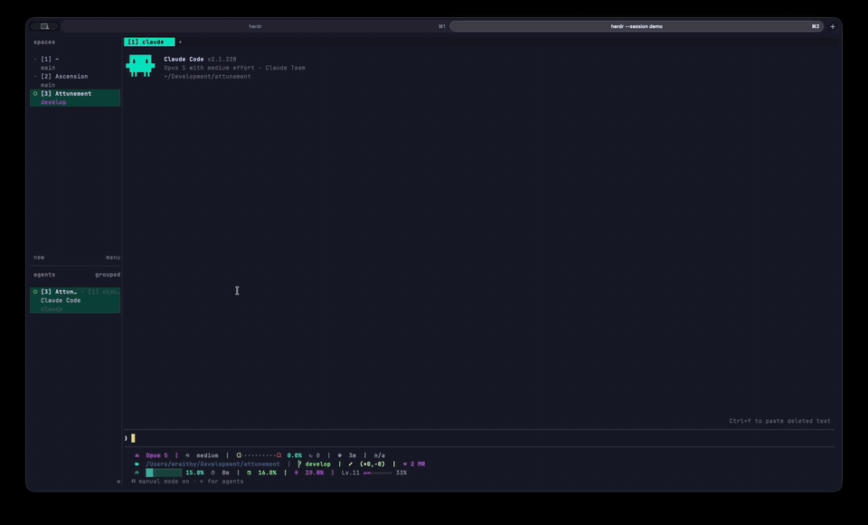

# herdr-openr

Jump to what your agent just did. One keypress → fuzzy picker over the
files and URLs the current pane mentioned. URLs open in your browser,
files in your editor at the right line — or reveal them in Finder /
your file manager, or copy the path.



Two modes, two keys: `prefix+o` scans the **visible viewport** of any pane;
`prefix+shift+o` reads the **Claude session transcript**
(`~/.claude/projects/<project>/<session>.jsonl`, resolved via the herdr
API) — exact paths from every Edit/Write/Read tool call, whole session
history, zero pane reads. Paths that don't exist are dropped.

There's also `openr.pick` (auto: Claude pane → transcript, otherwise
viewport) if you prefer one key for both — bind it yourself (example in
`herdr-plugin.toml`).

## Quick start

```bash
herdr plugin install wraithyy/herdr-openr
herdr plugin action invoke openr.install-keybind   # binds the keys now
```

The second command is optional — a startup hook binds `prefix+o` (visible)
and `prefix+shift+o` (transcript) by itself on the next herdr server start.
(prefix = herdr's leader key, ctrl+b by default. Different keys? Add your
own `[[keys.command]]` entries to `~/.config/herdr/config.toml` — the hook
never touches existing bindings.)

Needs `zsh`, `fzf`, `jq` (`bat` optional, nicer preview). macOS + Linux.

## Keys

| key | action |
|---|---|
| `enter` | URL → browser · file → editor at line |
| `ctrl-f` | reveal in Finder / open containing dir (Linux) |
| `ctrl-y` | copy path/URL |
| `esc` | cancel |

## Configure

Optional — `~/.config/herdr/plugins/config/openr/openr.conf`:

```sh
file_cmd='nvim +{line} {file}'   # bare {file}/{url}: values are pre-escaped
file_open_in="tab"               # "tab" herdr tab | "detached" GUI editors
url_cmd=""                       # empty = open / xdg-open
preview="1"
scan_source="visible"            # non-agent panes; recent* scrolls the pane
scan_lines=400
transcript_lines=1000            # agent panes

# VS Code:  file_open_in="detached"; file_cmd='code --goto {file}:{line}'
# Zed:      file_open_in="detached"; file_cmd='zed {file}:{line}'
# Helix:    file_open_in="tab";      file_cmd='hx {file}:{line}'
# IntelliJ: file_open_in="detached"; file_cmd='idea --line {line} {file}'
#   (needs the `idea` shell launcher; macOS without it:
#    file_cmd='open -na "IntelliJ IDEA" --args --line {line} {file}')
```

Popup size: `OPENR_WIDTH` / `OPENR_HEIGHT` (default `75%` / `60%`).

## Troubleshooting

- Key does nothing → check `herdr server reload-config` errors, `fzf`/`jq`
  on PATH; failures show an "openr" toast.
- Nothing opens over another popup/overlay — herdr allows one at a time.
- Paths with spaces are not detected (known limit).
- `~/.config/herdr/plugins/config/openr/last.log` = last dispatched
  command, `last-source.log` = last scanned pane + source.

## Prior art

Inspired by [termscope](https://github.com/iurysza/termscope), which pioneered
the "open what's on screen" jump list for herdr. openr grew out of wanting a
different shape of the same idea: Claude transcript as the primary source
instead of the viewport, a popup picker, and a configurable editor command
instead of a fixed nvim split.

## License

[MIT](LICENSE)
